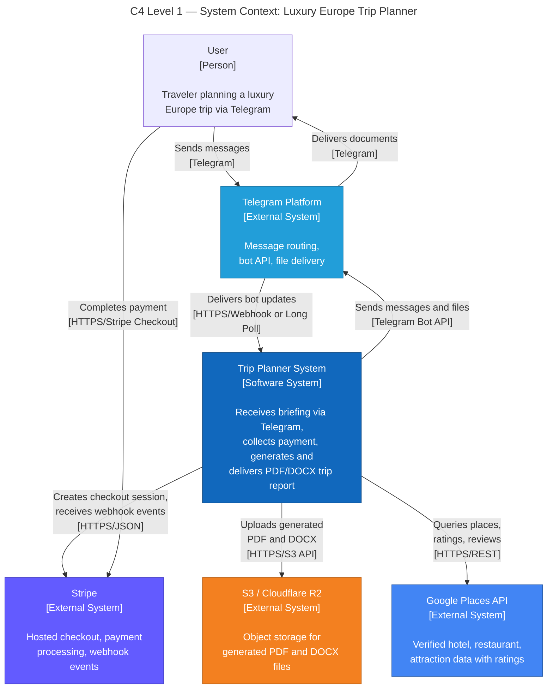
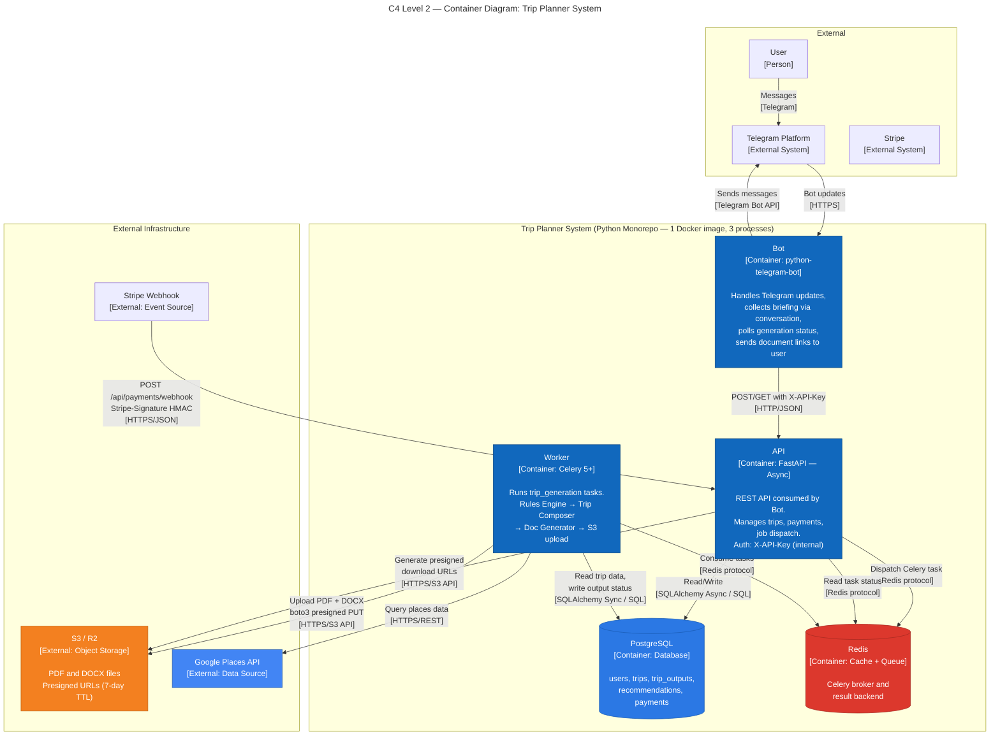
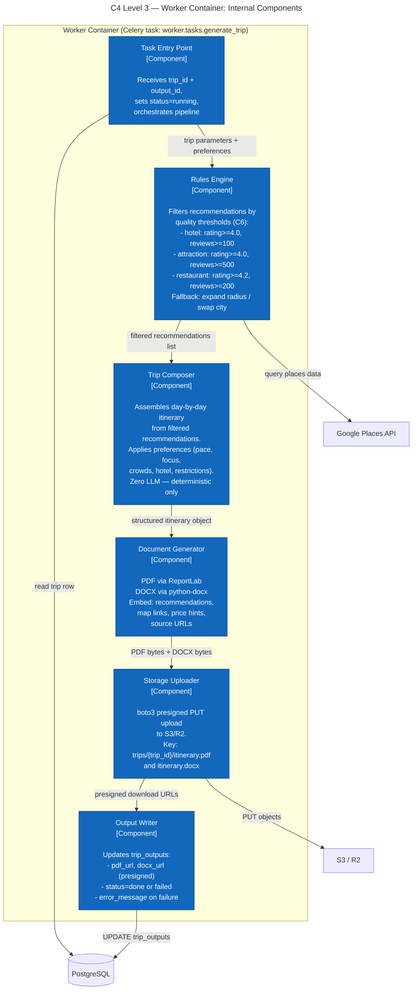
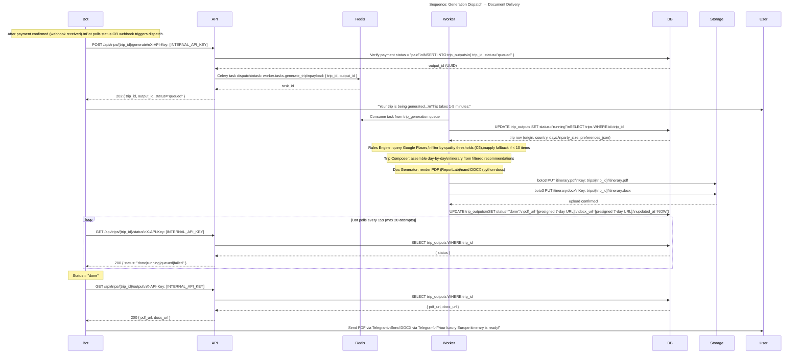
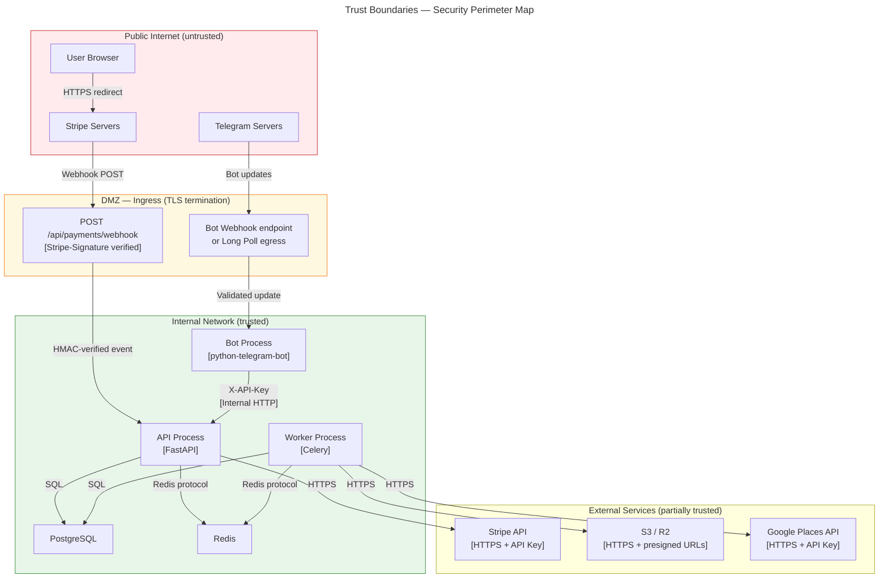

# Architecture — Luxury Europe Trip Planner Telegram Bot

**Version:** 1.0.0
**Date:** 2026-02-26
**Status:** Current
**Author:** Architect Agent

---

## Overview

A Python-based Telegram bot that sells personalized luxury Europe trip planning reports. Users interact via Telegram, pay via Stripe, and receive a PDF + DOCX itinerary generated by a deterministic rules engine backed by verified data sources (no LLM in MVP).

**Core principle:** 1 repo, 1 Python runtime, 3 separate processes (API, bot, worker), minimal moving parts.

---

## Architecture Characteristics (Priority Order)

| # | Characteristic | Rationale |
|---|---|---|
| 1 | **Reliability** | Paid product — generation failure = refund demand + trust loss |
| 2 | **Correctness** | Recommendations must meet quality thresholds; no hallucinations |
| 3 | **Security** | Payment webhook integrity; no secret leakage; Telegram token protection |
| 4 | **Deployability** | Small team; single Dockerfile; fast iteration cycle |
| 5 | **Maintainability** | Single Python runtime; shared models; no schema drift |
| 6 | **Performance** | Bot response < 15s (Telegram timeout); generation async via queue |

---

## Level 1 — System Context



---

## Level 2 — Container Diagram



---

## Level 3 — Worker Component Detail



---

## Flow 1 — Briefing to Payment

```mermaid
---
title: "Sequence: Briefing → Payment Confirmation"
---
sequenceDiagram
    actor User
    participant Telegram
    participant Bot
    participant API
    participant DB
    participant Stripe

    User->>Telegram: /start — begin trip planning
    Telegram->>Bot: Update: /start command

    Bot->>User: Collect briefing (origin, country, dates, days,\nparty size, budget, preferences)
    Note over Bot,User: Multi-step conversation; Bot collects all fields

    Bot->>API: POST /api/trips\n{telegram_user_id, origin, country,\ndates_or_month, days, party_size,\nbudget_per_person_brl, preferences}\nX-API-Key: [INTERNAL_API_KEY]
    API->>DB: INSERT INTO users (upsert)\nINSERT INTO trips
    DB-->>API: trip_id (UUID)
    API-->>Bot: 201 { trip_id }

    Bot->>API: POST /api/payments/create\n{ trip_id }\nX-API-Key: [INTERNAL_API_KEY]
    API->>Stripe: Create Checkout Session\namount_cents=10000, currency=BRL\nmetadata: { trip_id }
    Stripe-->>API: checkout_session { id, url }
    API->>DB: INSERT INTO payments\n{ trip_id, provider="stripe",\namount_cents=10000, status="pending",\nexternal_id=session.id }
    API-->>Bot: 200 { payment_url, payment_id, amount_brl=100 }

    Bot->>User: Send payment link (payment_url)\n"Click to pay R$100 via Stripe"
    User->>Stripe: Complete payment on hosted checkout page

    Stripe->>API: POST /api/payments/webhook\nStripe-Signature: [HMAC]\n{ type: "checkout.session.completed",\ndata: { session_id, metadata.trip_id } }
    API->>API: Verify Stripe-Signature HMAC
    API->>DB: UPDATE payments SET status="paid"\nWHERE external_id=session_id
    API-->>Stripe: 200 { received: true }

    Note over API,DB: Payment confirmed; generation can now be dispatched
```

---

## Flow 2 — Generation and Delivery



---

## Key Architecture Decisions Summary

| Decision | Choice | Rationale | ADR |
|---|---|---|---|
| Language / runtime | Pure Python (FastAPI + python-telegram-bot + Celery) | Document generation requires Python; avoids polyglot ops | ADR-001 |
| Async queue | Celery 5+ + Redis | Python-native; BullMQ requires Node.js (rejected by ADR-001) | ADR-002 |
| Payment provider | Stripe (MVP), MercadoPago (Phase 2) | Webhook reliability; Stripe HMAC; BRL native support | ADR-003 |
| AI/LLM | None in MVP — deterministic rules engine | Hallucination risk unacceptable for paid product; correctness > richness | ADR-004 |
| File delivery | Presigned S3/R2 URLs (7-day TTL) | No API proxying; no bandwidth cost; Telegram accepts direct URLs | C5 |
| Internal auth | X-API-Key header (bot → API) | Simple, auditable; no user JWT complexity in MVP | C7 |
| Webhook auth | Stripe-Signature HMAC only | Stripe-managed; PCI SAQ A scope maintained | C3 |

---

## Trust Boundaries



---

## Fitness Functions

All fitness functions are defined with a measurable threshold, enforcement method, and owner.

### Performance

| ID | Characteristic | Metric | Threshold | Method | Frequency | Action on Violation |
|---|---|---|---|---|---|---|
| FF-001 | Performance | Bot → API roundtrip p99 latency | < 200ms (localhost) | Integration test (httpx) | Per commit | Block CI |
| FF-004 | Performance | Worker job completion (10-day trip) | < 5 minutes | Integration test (mocked data) | Per commit | Block CI |
| FF-009 | Performance | Payment webhook → generation dispatch | < 10 seconds | Integration test (Stripe CLI) | Per commit | Block CI |

### Correctness

| ID | Characteristic | Metric | Threshold | Method | Frequency | Action on Violation |
|---|---|---|---|---|---|---|
| FF-012 | Correctness | Every recommendation has `source_url` | 100% | Output validation test | Per commit | Block CI |
| FF-013 | Correctness | No recommendation below quality threshold | Zero violations | Parse output, assert rating/review_count | Per commit | Block CI |
| FF-010 | Correctness | `payments.status="paid"` requires valid `external_id` | 100% | DB constraint check in CI | Per commit | Block CI |

### Security

| ID | Characteristic | Metric | Threshold | Method | Frequency | Action on Violation |
|---|---|---|---|---|---|---|
| FF-008 | Security | Stripe webhook rejects invalid signature | 100% rejection | Unit test: tampered payload → 400 | Per commit | Block CI |
| FF-011 | Security | Zero plaintext secrets in code or logs | Zero occurrences | git-secrets pre-commit + CI secret scanner | Per commit + Per push | Block commit/push |
| FF-014 | Security | No LLM API calls in generation pipeline | Zero egress to LLM endpoints | Network egress allowlist in CI | Per commit | Block CI |

### Reliability

| ID | Characteristic | Metric | Threshold | Method | Frequency | Action on Violation |
|---|---|---|---|---|---|---|
| FF-005 | Reliability | Failed Celery task rate (non-retryable) | < 1% | Flower + Sentry monitoring | Real-time | PagerDuty alert |
| FF-006 | Reliability | `trip_outputs.status` update lag | < 2 seconds from task state change | Polling integration test | Per commit | Block CI |
| FF-007 | Reliability | Redis broker visibility timeout | >= 600s | CI config lint check | Per commit | Block CI |

### Maintainability

| ID | Characteristic | Metric | Threshold | Method | Frequency | Action on Violation |
|---|---|---|---|---|---|---|
| FF-002 | Maintainability | Docker image build time | < 3 minutes | CI timer | Per commit | Alert (non-blocking) |
| FF-015 | Maintainability | Rules engine fallback logged when triggered | 100% of fallback events | Integration test: city with < 10 qualifying items | Per commit | Block CI |

---

## Failure Modes and Mitigation

| Component | Failure Mode | Blast Radius | Detection | Mitigation |
|---|---|---|---|---|
| Celery Worker | Task stuck / crash mid-generation | Single trip generation fails | Flower task state, Sentry error | Retry (3x, exponential backoff); `status=failed` + `error_message` in DB; user notified |
| Redis | Connection failure | All task dispatch fails; API returns 503 on POST /generate | Redis health check, API startup probe | Worker retries on reconnect; bot informs user to retry later |
| PostgreSQL | Connection failure | All endpoints fail (no DB = no state) | DB health check, API startup probe | Connection pool with retry; circuit breaker pattern on API startup |
| Stripe Webhook | Delayed/duplicate events | Payment confirmed late or double-confirmed | Stripe event ID deduplication | Idempotency: check `external_id` before updating `payments.status`; Stripe retries up to 3 days |
| S3/R2 | Upload failure | Generation completes but no file delivered | boto3 exception, Sentry | Worker retries upload 3x; if all fail, `status=failed`; presigned URL on retry |
| Google Places API | Rate limit or outage | Rules engine cannot fetch data | HTTP 429/5xx in worker | Exponential backoff with jitter; cached results for recent queries; fallback to reduced recommendation set |
| Bot | Long polling disconnect | Bot misses updates temporarily | python-telegram-bot reconnect logic | Auto-reconnect built into library; no message loss (Telegram queues updates) |

---

## Environment Variables (Contract with DevOps)

All configuration via environment variables. No hardcoded values in code.

| Variable | Consumer | Description |
|---|---|---|
| `DATABASE_URL` | API, Worker | PostgreSQL async DSN (asyncpg for API, psycopg2 for Worker) |
| `REDIS_URL` | API, Worker | Redis connection URL (Celery broker + result backend) |
| `TELEGRAM_BOT_TOKEN` | Bot | Telegram Bot API token |
| `INTERNAL_API_KEY` | Bot, API | Shared secret for bot → API authentication |
| `STRIPE_SECRET_KEY` | API | Stripe API secret key |
| `STRIPE_WEBHOOK_SECRET` | API | Stripe webhook signing secret (for HMAC verification) |
| `S3_BUCKET_NAME` | Worker | S3/R2 bucket name |
| `S3_ENDPOINT_URL` | Worker | S3-compatible endpoint (omit for AWS; set for R2) |
| `AWS_ACCESS_KEY_ID` | Worker | S3/R2 access key |
| `AWS_SECRET_ACCESS_KEY` | Worker | S3/R2 secret key |
| `GOOGLE_PLACES_API_KEY` | Worker | Google Places API key |
| `SENTRY_DSN` | API, Worker, Bot | Sentry error tracking DSN |
| `ENVIRONMENT` | All | `development` / `staging` / `production` |

---

## Open Questions for Tech Lead

1. **Telegram update delivery mode:** Webhook (requires public HTTPS endpoint from day one) vs Long Polling (simpler local dev, works behind NAT). Recommend starting with Long Polling in development and switching to webhook in production. DevOps agent to confirm public endpoint availability.

2. **Google Places API quota:** Current plan assumes Google Places as the primary data source. Google Places API has a free tier limit (~1000 requests/day free, then $17/1000). For 10-day trip with multiple cities and categories, estimate 50–200 Places API calls per generation. At 100 generations/day, this is 5,000–20,000 calls/day — well above free tier. DevOps to set up billing alert. Architect recommendation: add a Places result cache in Redis (TTL: 24h) to reduce calls per generation.

3. **Presigned URL delivery via Telegram:** Telegram accepts external URLs for file sending (via `send_document(url=...)` only if < 50MB). PDF/DOCX are typically 1–5MB — within limit. Confirm: does python-telegram-bot support sending by URL or does it require downloading to memory first? This affects whether the bot needs to download files or can pass presigned URLs directly.

4. **MercadoPago Phase 2 timeline:** ADR-003 defers MercadoPago to Phase 2 but the `payments.provider` column already supports it. PM agent to define the Phase 2 trigger condition (user feedback volume? payment abandonment rate threshold?).

5. **Redis persistence:** Celery uses Redis as broker. If Redis restarts with `--no-save` (in-memory only), queued tasks that haven't been consumed are lost. For MVP, recommend Redis with `appendonly yes` (AOF persistence) or at minimum RDB snapshots. DevOps to confirm `docker-compose.yml` Redis config.

---

## ADR Index

| ADR | Decision | Status |
|---|---|---|
| [ADR-001](adr/ADR-001-python-monorepo.md) | Pure Python monorepo over Node.js + Python polyglot | Accepted |
| [ADR-002](adr/ADR-002-celery-vs-bullmq.md) | Celery + Redis over BullMQ (Node.js) | Accepted |
| [ADR-003](adr/ADR-003-stripe-primary-payment.md) | Stripe for MVP, MercadoPago Phase 2 | Accepted |
| [ADR-004](adr/ADR-004-no-llm-in-mvp.md) | No LLM in MVP — deterministic rules engine only | Accepted |
